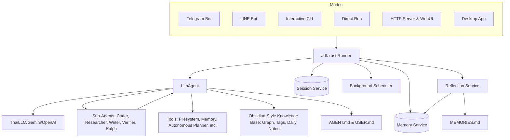

# nami: AI Bot

> **Note:** This project is currently under active development.

A modular, extensible AI-powered `Nami` built on top of [adk-rust](https://github.com/zavora-ai/adk-rust) and the [teloxide](https://github.com/teloxide/teloxide) framework. This project demonstrates how to leverage modern Rust libraries to build sophisticated AI agents with persistent sessions, filesystem sandbox capabilities, and dynamic persona management.


## 🚀 Features & Capabilities

### 🧠 Core Intelligence & Orchestration

* **Multi-Platform AI**: Powered by Gemini, Anthropic, or any OpenAI-compatible LLM (e.g., ThaiLLM).
* **Telegram & LINE Bot Integration**: Seamlessly interact with the agent through popular messaging platforms. Supports persistent sessions and high-performance message processing.
* **Agent Reflection Service**: A background service that periodically analyzes session logs to synthesize "Learnings" (facts, preferences, project context) and automatically update `MEMORIES.md` and searchable memory.
* **AI Gateway Integration**: Support for high-availability routing via **MLflow Deployments**, enabling load balancing and fallback strategies across multiple LLM providers.
* **Native PDF & Marp Slides Rendering**: Directly view PDF documents and render Marp Markdown presentations (using `marp: true` frontmatter) within the WebUI preview canvas.
* **Specialist Agents**: Ecosystem of specialized agents (`coder`, `researcher`, `writer`, `generalist`, `verifier`, `ralph`) with full access to core tools (filesystem, search, knowledge base), allowing for autonomous complex task execution.
* **Autonomous Planner (PEV Loop)**: A unified toolset (`plan_create`, `plan_execute`, etc.) that automatically generates multi-step implementation plans, delegates steps to specialized agents, verifies execution correctness via critic feedback, and triggers self-healing dynamic replanning on verification failures.
* **Native Image Generation**: Implemented a native image generation tool using `gemini-2.5-flash-image-preview`, providing high-quality, efficient visuals directly within the agent's workflow without external script dependencies.
* **Parallel Task Execution**: A custom `parallel_tasks` tool that orchestrates multiple specialists simultaneously for high-speed multi-tasking.
* **Autonomous Goal Loops**: A "Ralph Wiggum" loop agent that persists through multiple iterations to achieve complex goals, triggered via `/goal`.
* **Hybrid MCP Support**: Seamlessly connect to both local (stdio-based) and remote (streamable HTTP/SSE) [Model Context Protocol](https://modelcontextprotocol.io/) servers. Tools are automatically namespaced with `mcp_` to prevent collisions.
* **Native Desktop App (Tauri)**: A premium, cross-platform desktop experience built with Tauri v2. Features an embedded Nami server, native window management, and a high-performance React UI.

### 💻 Rich User Interface

* **Premium Antigravity 2.0 WebUI**: A modern, decomposed component architecture (`ChatHeader`, `MessageList`, `MessageItem`, `ChatInput`) overhauled to look premium using Outfit (headings) and Inter (UI/body copy) Google Fonts, ultra-thin slate lines, responsive session history cards, slate-900 user bubbles, and soft tech-gray assistant cards.
* **Knowledge Base Explorer**: A dedicated "Knowledge Base" tab in the WebUI sidebar allowing users to browse their Obsidian-style knowledge vault via an interactive, hierarchical folder-tree. Clicking any knowledge file instantly renders its content inside the rich preview panel.
* **Modern CLI**: A rich, interactive CLI experience with a custom ASCII banner, animated indicators, **startup discovery counts for MCP/Skills**, pretty error rendering with intelligent hints, and structured layout.
* **Focused Input Control**: Implements terminal raw mode during processing to block echoes, ensuring a clean and focused agent execution state.
* **Silent Cancellation**: Support for both `Ctrl+C` and silent `ESC` interruption, allowing users to cancel requests without terminal clutter.
* **Slash Commands**: Quick access to system functions:
  * `/new`: Reset current session.
  * `/clear`: Clear terminal screen.
  * `/parallel`: Run tasks in parallel using specialists.
  * `/goal`: Run autonomous loops to achieve goals.
  * `/schedule`: Manage automated tasks with cron expressions.
  * `/grill`: Start an interactive Q&A alignment session to refine goals and generate precise plans (Grill-Me).
  * `/status`: View real-time agent and system status.
  * `/km`: Search the knowledge vault.
  * `/memo`: Save information to long-term memory.
  * `/recall`: Search and recall facts from memory.
  * `/learn`: Reflect on recent successes or corrections to capture reusable skills or rules.
* **@ File Context References**: Reference files from the `workspace/` directly in the CLI using `@path/to/file` with built-in Tab-completion.
* **Dynamic Persona & Soul**: Configure the bot's personality and user context via global or workspace `AGENT.md` and `USER.md`. Automatically updated `MEMORIES.md` tracks personal user facts.

### 📂 Knowledge & Session Management

* **Globalized Sandbox System**: Fully migrated from purely local workspaces to a centralized, global environment residing in `~/.nami/`. Central databases, global logging, globalized skills, and system-wide state protocol tracking are securely sandboxed inside the user's home directory.
* **Multi-Workspace Auto-Discovery**: Automatically discover, switch, and track configurations and state across multiple active project workspaces from the central system.
* **Long-Term Searchable Memory**: Integrated `adk-memory` with a SQLite backend. This allows the agent to search past conversations for relevant facts and projects across all modes (CLI, Bot, Serve, Desktop).
* **Obsidian-Style Knowledge Base**: A transparent, human-readable Knowledge Management system using OKF v0.2 `.md` files with strict Knowledge Base-first search prioritization and automatic external search knowledge capture.
  * `add_km_page`: Markdown saving with `[[wikilink]]` syntax and OKF v0.2 YAML frontmatter.
  * `get_km_graph`: Knowledge graph visualization.
  * `search_km_by_tag`: Filter notes by specific `#tags`.
  * `create_daily_note`: Journal entries for the current date.
  * `get_backlinks`: List pages linking to a specific note.
  * `rename_km_page`: Safe renaming with link updates.
* **Persistent Sessions**: SQLite-backed conversation history keyed by Telegram user ID.
* **Todo Management**: Built-in task manager for tracking goals and daily items (`add_todo`, `list_todos`, `mark_todo_done`).

### 🛠 Specialized Skills & Tools

* **Unified Serve Server**: A consolidated HTTP serve mode (`nami serve`) combining a headless API server with a fully embedded, self-contained premium WebUI static asset delivery system, removing the need for a separate `browse` mode.
* **Centralized Global Skill Registry**: Allows discovery, loading, and execution of modular tools and extensions globally or per-workspace, managed dynamically via the central `~/.nami/` registry.
* **Publishing Skills**: Compile workspace documents into distributable formats:
  * `create-pdf`: Beautifully formatted PDF documents.
  * `create-epub`: EPUB e-books with BOM sanitization.

### 🧩 Agent Skills

Nami Core is designed for extreme extensibility. You can add new capabilities by deploying modules to the `.skills/` directory.

* **Extensibility Model**: Skills are modular components that bundle specialized scripts and configuration. They allow Nami to perform complex, domain-specific tasks without modifying core code.
* **Skill Management**: You can manage, create, and validate skills using the `skill-creator` extension.
* **Workspace Configuration**: The `webui/` workspace uses `pnpm` with a workspace configuration (`pnpm-workspace.yaml`) to optimize dependency management and build reproducibility for `esbuild` and other toolchains.

### Currently Available Skills

* **Book Mockup**: Generate photo-realistic book mockup images using the `image_generator` tool.
* **CLI Help**: Interactive command references and usage patterns via `cli-help`.
* **Publishing Suite**: Automate documentation delivery (`create-pdf`, `create-epub`).
* **Infographic Creator**: Scaffolding and generation for data-rich infographics using the `image_generator` tool.
* **Website Creator**: Scaffolding for static website projects.
* **Nami Blog Manager**: Tools for managing blog posts, metadata, and references.
* **Skill Creator**: Utilities for initializing, packaging, and validating new skills.
* **System Status**: Monitor and report on system health and agent performance.

*(To add a custom skill, check the `workspace/.skills/skill-creator` documentation for templates and packaging tools.)*

### 🛡 System & Safety

* **Persistent Task Scheduler**: A `crontab`-style background system that automatically retries unfinished tasks and persists state in `scheduler.json`.
* **Sandboxed Environment**: Integrated filesystem tools for agent tasks within a `workspace/` directory, protected by a **`.namiignore` policy** (similar to `.gitignore`) to control access permissions.
* **Observability Stack**: Integrated OpenTelemetry collector and MLflow for robust tracing and experiment tracking.
* **Live Web Search**: Integrated Google Search via Serper.dev.
* **Performance Optimized Builds**: Highly tuned release profile with Link-Time Optimization (LTO), single codegen units, and automatic symbol stripping for maximum runtime efficiency.
* **Organized Codebase**: Clean source tree with 27+ focused modules in `agent/`, `modes/`, `tools/`, and `utils/` directories. Large modules split into submodules (knowledge, filesystem, init, cli, utils) for maintainability. Duplicated and dead code eliminated.

## 🛠 Prerequisites

* Rust ([rustup](https://rustup.rs/))
* A Telegram Bot Token from [@BotFather](https://t.me/BotFather)
* API Key for your chosen LLM (Gemini, OpenAI, or ThaiLLM)
* (Optional) [Serper.dev](https://serper.dev/) API Key for Google Search features.

## ⚙️ Configuration

1. Copy `.env.example` to `.env` and configure your credentials:

```bash
cp .env.example .env
cp webui/.env.example webui/.env
```

```text
# Root .env
GOOGLE_API_KEY=your_google_api_key_here
THAILLM_API_KEY=your_api_key_here
TELOXIDE_TOKEN=your_telegram_bot_token
SERPER_API_KEY=your_serper_api_key
OTEL_COLLECTOR=your_otel_collector_url
NAMI_API_KEY=your_secure_random_key_here

# webui/.env
VITE_NAMI_API_KEY=your_secure_random_key_here
```

1. Customize the Bot's Soul:

* Edit `workspace/AGENT.md` to change the name, personality, and tone.
* Edit `workspace/USER.md` to provide context about yourself and your preferences.

## 🏃 Getting Started

### Build and Install

1. **Build the application**:
   The project uses a `Makefile` to automate the build process, including WebUI asset compilation and Rust binary generation.

   ```bash
   make build
   ```

   Alternatively, for a standard Rust build (requires `webui/dist/` to be populated):

   ```bash
   cargo build --release
   ```

   The generated executable will be found in `target/release/`.

1. **(Optional) Install globally**:
   To run `nami` from any directory, you can move the binary to a location in your system's `PATH`:

   * **Linux/macOS**:

     ```bash
     sudo mv target/release/nami /usr/local/bin/
     ```

   * **Windows**:
     Add the full path of the `target\release\` directory to your system's Environment Variables (PATH).

### Running

The application provides several run modes:

| Mode | Command | Description |
| :--- | :--- | :--- |
| **Initialize** | `nami init` | Initialize project config files and database. |
| **Telegram Bot** | `nami bot` | Start the interactive Telegram Bot. |
| **LINE Bot** | `nami line` | Start the LINE Bot webhook server. |
| **CLI** | `nami cli` | Local interactive terminal agent with autocomplete and file references. |
| **Run** | `nami run <prompt>` | Execute a single prompt directly from the CLI. |
| **Server** | `nami serve` | Start the HTTP server with embedded premium WebUI and APIs. |
| **Desktop (Dev)** | `make desktop-dev` | Launch the native Tauri desktop app in development mode. |
| **Desktop (Build)** | `make desktop` | Build the production desktop installer (MSI, DMG, DEB). |

## 🏗 Architecture

The system supports multiple entry points sharing the same core agent logic:



## 💡 Development Tips

Here are some best practices for extending and maintaining Nami:

### 🚀 Getting Started & Production

* **Production Readiness**: For high-traffic bots, migrate `teloxide` from polling to webhooks for better reliability.
* **Build Optimization**: Use `make build` to compile the React assets into `webui/dist/` before compiling the final Rust binary. This ensures the embedded static WebUI in `nami serve` is fully up to date.
* **WebUI Development**: Run a separate hot-reloading dev server with `pnpm --filter webui dev` in one terminal, while pointing it to the native server running `nami serve` in another.
* **Environment Management**: Always manage your credentials via the `.env` file; never hardcode API keys.

### 🎨 WebUI Styling Guidelines (Antigravity 2.0 Theme)

* **Premium Typography**: Headings and titles should use the `Outfit` font family (`font-display`). User interface and body copy should use `Inter` (`font-sans`).
* **Slate/Grayscale Hierarchy**: Stick strictly to polished slate scale borders (`border-slate-100` / `border-slate-200/80`), soft background fills (`bg-slate-50/50`), deep slate user bubbles (`bg-slate-900`), and clean white/slate-50 agent cards. Avoid harsh pure black borders or default saturated colors.
* **Micro-Animations**: Implement fine transitions on hover and active states (e.g., `transition-all duration-200 hover:scale-[1.01] hover:bg-slate-50`) to keep the experience feeling modern and alive.

### 🧩 Extending Nami

* **New Skills**: You can add new capabilities by deploying modules to the `workspace/.skills/` directory. Use the `skill-creator` extension to initialize, package, and validate them.
* **Specialist Agents**: For complex tasks, delegate to existing specialists (`coder`, `researcher`, `writer`) via the `parallel_tasks` tool or `/parallel` slash command.
* **Knowledge Base-First Development**: Always document successful patterns in your `km/` vault. Use the "Knowledge Base-before-Google" protocol to reduce noise and maintain project-specific context.

### 🧠 System Architecture & Advanced Features

* **RAG & Memory**: Consider connecting your `km/` vault to a vector database (e.g., Qdrant/Milvus) for semantic search if your knowledge base outgrows simple file-based retrieval.
* **Tooling Strategy**: When creating new skills, prefer native Rust `#[tool]` macros over external scripts for better performance, type safety, and security.
* **Agentic Intelligence**: Explore the potential of Meta-Agents that review tool outputs for quality, automatically triggering re-tries or pivots when thresholds aren't met.
* **Task-Knowledge Bridging**: Automate your daily note templates to automatically pull active tasks from the `StateManager` to maintain a living sync between your todo list and your knowledge base.
