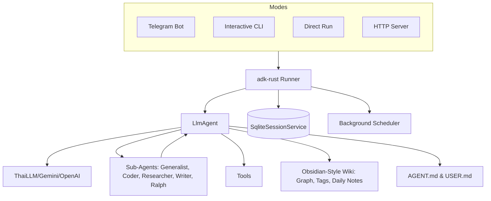

# nami: AI Bot

A modular, extensible AI-powered `Nami` built on top of [adk-rust](https://github.com/zavora-ai/adk-rust) and the [teloxide](https://github.com/teloxide/teloxide) framework. This project demonstrates how to leverage modern Rust libraries to build sophisticated AI agents with persistent sessions, filesystem sandbox capabilities, and dynamic persona management.


## 🚀 Features & Capabilities

### 🧠 Core Intelligence & Orchestration
*   **Multi-Platform AI**: Powered by Gemini, Anthropic, or any OpenAI-compatible LLM (e.g., ThaiLLM).
*   **Tool-Enabled Specialist Agents**: Ecosystem of specialized agents (`coder`, `researcher`, `writer`, `generalist`, `ralph`) with full access to core tools (filesystem, search, wiki), allowing for autonomous complex task execution.
*   **Parallel Task Execution**: A custom `parallel_tasks` tool that orchestrates multiple specialists simultaneously for high-speed multi-tasking.
*   **Autonomous Goal Loops**: A "Ralph Wiggum" loop agent that persists through multiple iterations to achieve complex goals, triggered via `/goal`.
*   **Hybrid MCP Support**: Seamlessly connect to both local (stdio-based) and remote (streamable HTTP/SSE) [Model Context Protocol](https://modelcontextprotocol.io/) servers. Tools are automatically namespaced with `mcp_` to prevent collisions.

### 💻 Rich User Interface
*   **Modern TUI**: A rich, interactive CLI experience with a custom ASCII banner, animated indicators, pretty error rendering with intelligent hints, and structured layout.
*   **Focused Input Control**: Implements terminal raw mode during processing to block echoes, ensuring a clean and focused agent execution state.
*   **Silent Cancellation**: Support for both `Ctrl+C` and silent `ESC` interruption, allowing users to cancel requests without terminal clutter.
*   **Slash Commands**: Quick access to system functions:
    *   `/new`: Reset current session.
    *   `/parallel`: Run tasks in parallel.
    *   `/goal`: Run autonomous loops.
    *   `/schedule`: Manage automated tasks with cron.
    *   `/plan`: Initialize structured tasks.
*   **@ File Context References**: Reference files from the `workspace/` directly in the CLI using `@path/to/file` with built-in Tab-completion.
*   **Dynamic Persona & Soul**: Configure the bot's personality and user context via `workspace/AGENT.md` and `workspace/USER.md`. Automatically updated `workspace/MEMORIES.md` tracks personal user facts.

### 📂 Knowledge & Session Management
*   **Obsidian-Style Wiki KM**: A transparent, human-readable Knowledge Management system using `.md` files.
    *   `add_wiki_page`: Markdown saving with `[[wikilink]]` syntax.
    *   `get_wiki_graph`: Knowledge graph visualization.
    *   `search_wiki_by_tag`: Filter notes by specific `#tags`.
    *   `create_daily_note`: Journal entries for the current date.
    *   `get_backlinks`: List pages linking to a specific note.
    *   `rename_wiki_page`: Safe renaming with link updates.
*   **Persistent Sessions**: SQLite-backed conversation history keyed by Telegram user ID.
*   **State Management**: A structured JSON-based system for tracking long-running tasks, guided by `workspace/STATE_PROTOCOL.md`.
    *   `init_task`: Initialize new processes with goals and steps.
    *   `update_task`: Progress tracking and persistent context.
    *   `list_active_tasks`: View all in-progress or blocked tasks.
*   **Todo Management**: Built-in task manager for tracking goals and daily items (`add_todo`, `list_todos`, `mark_todo_done`).

### 🛠 Specialized Skills & Tools
*   **AI Image Generation**: Integrated `Imagen` capabilities via `.skills/imagen/` for high-quality image creation.
*   **Publishing Skills**: Compile workspace documents into distributable formats:
    *   `create-pdf`: Beautifully formatted PDF documents.
    *   `create-epub`: EPUB e-books with BOM sanitization.

## 🧩 Agent Skills
Nami Core is designed for extreme extensibility. You can add new capabilities by deploying modules to the `workspace/.skills/` directory.

*   **Extensibility Model**: Skills are modular components that bundle specialized scripts and configuration. They allow Nami to perform complex, domain-specific tasks without modifying core code.
*   **Skill Management**: You can manage, create, and validate skills using the `skill-creator` extension.

### Currently Available Skills
*   **Imagen**: AI image generation capabilities via `.skills/imagen/`.
*   **Book Mockup**: Generate photo-realistic book mockup images.
*   **CLI Help**: Interactive command references and usage patterns via `cli-help`.
*   **Publishing Suite**: Automate documentation delivery (`create-pdf`, `create-epub`).
*   **Infographic Creator**: Scaffolding and generation for data-rich infographics.
*   **Website Creator**: Scaffolding for static website projects.
*   **Nami Blog Manager**: Tools for managing blog posts, metadata, and references.
*   **Skill Creator**: Utilities for initializing, packaging, and validating new skills.
*   **System Status**: Monitor and report on system health and agent performance.

*(To add a custom skill, check the `workspace/.skills/skill-creator` documentation for templates and packaging tools.)*

### 🛡 System & Safety
*   **Persistent Task Scheduler**: A `crontab`-style background system that automatically retries unfinished tasks and persists state in `scheduler.json`.
*   **Sandboxed Environment**: Integrated filesystem tools for agent tasks within a `workspace/` directory, protected by a **`.namiignore` policy** (similar to `.gitignore`) to control access permissions.
*   **Observability Stack**: Integrated OpenTelemetry collector and MLflow for robust tracing and experiment tracking.
*   **Live Web Search**: Integrated Google Search via Serper.dev.
*   **Performance Optimized Builds**: Highly tuned release profile with Link-Time Optimization (LTO), single codegen units, and automatic symbol stripping for maximum runtime efficiency.
*   **Modular Architecture**: Organized structure for adding capabilities (Weather, Search, Shell, Wiki, etc.).

## 🛠 Prerequisites

* Rust ([rustup](https://rustup.rs/))
* A Telegram Bot Token from [@BotFather](https://t.me/BotFather)
* API Key for your chosen LLM (Gemini, OpenAI, or ThaiLLM)
* (Optional) [Serper.dev](https://serper.dev/) API Key for Google Search features.

## ⚙️ Configuration

1. Copy `.env.example` to `.env` and configure your credentials:

```bash
cp .env.example .env
```

```text
GOOGLE_API_KEY=your_google_api_key_here
THAILLM_API_KEY=your_api_key_here
TELOXIDE_TOKEN=your_telegram_bot_token
SERPER_API_KEY=your_serper_api_key
```

1. Customize the Bot's Soul:

* Edit `workspace/AGENT.md` to change the name, personality, and tone.
* Edit `workspace/USER.md` to provide context about yourself and your preferences.

## 🏃 Getting Started

### Build and Install

1. **Build the application**:
   The project uses a `Makefile` to automate the build process, including WebUI asset compilation and Rust binary generation.

   ```bash
   make build
   ```

   Alternatively, for a standard Rust build (requires `webui/dist/` to be populated):
   ```bash
   cargo build --release
   ```

   The generated executable will be found in `target/release/`.

2. **(Optional) Install globally**:
   To run `nami` from any directory, you can move the binary to a location in your system's `PATH`:

   * **Linux/macOS**:

     ```bash
     sudo mv target/release/nami /usr/local/bin/
     ```

   * **Windows**:
     Add the full path of the `target\release\` directory to your system's Environment Variables (PATH).

### Running

The application provides five primary run modes:

| Mode | Command | Description |
| :--- | :--- | :--- |
| **Initialize** | `nami init` | Initialize project config files and database. |
| **Telegram Bot** | `nami bot` | Start the interactive Telegram Bot. |
| **CLI** | `nami cli` | Local interactive terminal agent with rich TUI. |
| **Run** | `nami run <prompt>` | Execute a single prompt directly from the CLI. |
| **Server** | `nami serve` | Run as an HTTP service. |
| **Browse** | `nami browse` | Start server with embedded WebUI. |

## 🏗 Architecture

The system supports multiple entry points sharing the same core agent logic:



## 💡 Developer Tips

* **Production**: For high-traffic bots, migrate `teloxide` from polling to webhooks.
* **Future Extension Ideas**:
    * **RAG Integration**: Connect the `wiki/` vault to a vector database (like Qdrant or Milvus) for semantic search and long-term memory retrieval.
    * **Vision & Multi-modal**: Enable vision tools to allow Nami to analyze screenshots or images sent via Telegram.
    * **Voice Mode**: Integrate Whisper for voice-to-text, allowing you to talk to Nami directly.
    * **Automated Evaluations**: Build an `eval/` suite to test Nami's tool-calling accuracy across different model versions.
    * **LLM Self-Correction Loops**: Implement a meta-agent that reviews the output of other tools, automatically detecting errors and triggering a re-try or pivot if the quality threshold isn't met.
    * **Dynamic Multi-Model Routing**: Implement an intelligent router that dynamically selects the cheapest or fastest model based on the complexity of the current task.
    * **Edge-Compute Caching Layer**: Add a local Redis/Key-Value cache to store frequent tool results, reducing latency and cost for repetitive tasks.
    * **Agent Reflection Service**: A background service that periodically analyzes session logs to synthesize "Learnings" and automatically update `MEMORIES.md`.
