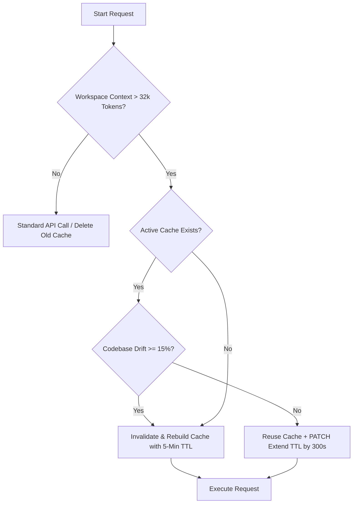

# Advanced Context Caching in Nami Core

Nami implements an advanced, dynamic context caching system for Gemini and Vertex models to drastically reduce token usage, lower costs, and minimize API latency. This is particularly crucial when dealing with massive codebase directories, source structures, and long-turn conversation contexts.

---

## 🚀 Key Features

### 1. Dynamic Threshold Triggering

Caching is highly optimized and only triggers when the repository context size warrants it.

* **Size Threshold**: Caching activates only when the aggregated static context (all eligible workspace source files) exceeds **128,000 characters** (approx. **32k tokens**).
* **Bypass & Clean-up**: If the context size falls below the threshold, context caching is bypassed, and any stale remote caches are proactively deleted to prevent extra cloud storage fees.

### 2. Layered Invalidation Strategy

To prevent unnecessary re-uploads on minor file changes (e.g., a simple code modification or save), Nami employs a percentage-based **Layered Invalidation Strategy**.

* **Drift Tolerance**: The codebase files are scanned, and hashes are compared with the cached state.
* **15% Threshold**: A full cache invalidation and rebuild on the Gemini/Vertex API are only triggered if the ratio of added, deleted, and modified files exceeds **15%** of the base codebase.
* **Dynamic Delta**: For drifts under 15%, the stable base cache remains intact, and the active changes are handled dynamically by the runner.

### 3. Active TTL Extension (5-Min Rolling Window)

Instead of static 1-hour leases, Nami deploys a rolling lease strategy:

* **Initial TTL**: New caches are created with a lightweight **5-minute (300 seconds)** TTL.
* **Active Extension**: On every conversation turn where the cache is successfully reused, Nami triggers an asynchronous `PATCH` request to the Google Generative Language API, resetting/extending the cache's TTL by another **300 seconds**.
* **Automatic Expiry**: Once the user stops interacting with the agent, the cache automatically expires and is garbage collected after 5 minutes of inactivity.

---

## 🛠️ Implementation Details

The context caching is located in `src/utils/gemini_cache.rs` and integrated directly into Nami's orchestrator layer (`src/runner.rs` and `src/modes/cli.rs`).

### State Tracking Format

The cache state is persisted locally at `<nami_dir>/gemini_cache_state.json` using the following schema:

```json
{
  "cache_name": "cachedContents/abcdef123456",
  "model_name": "gemini-2.5-flash",
  "file_hashes": {
    "src/main.rs": "8a32b6...",
    "Cargo.toml": "b132e4..."
  }
}
```

### Flow Architecture


